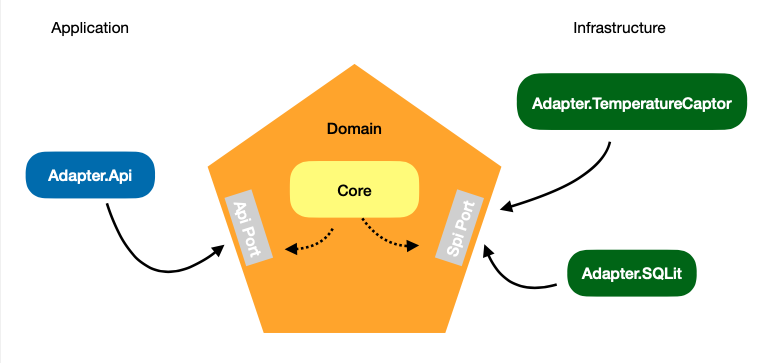

Pour répondre au besoin j'ai opté pour une architecture hexagonale, pour plusieurs raisons :
Isoler mon domaine des autres parties de la solution, pour avoir une application testable découplée et flexible aux changements.

Ce diagramme montre les différentes parties de la solution et comment elles sont liées les unes aux autres

Pour les tests j'ai opté pour deux approches TDD et BDD :
* TDD : 
  * Adapter.Api.Tests pour les tests unitaires de l'Adapter.Api 
  * Adapter.SQLit.Tests pour les tests unitaires de Adapter.SQLLit

* BDD (SpecFlow) :
  * Core.Tests pour les tests unitaires du domain projet Core
  * Tests d'intégration suivant l'approche BDD, Sensor.App.Tests
